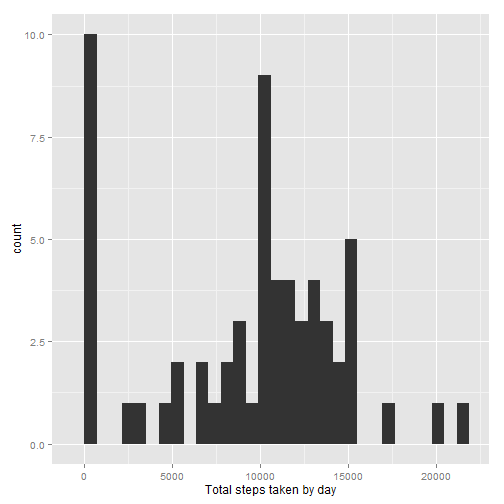
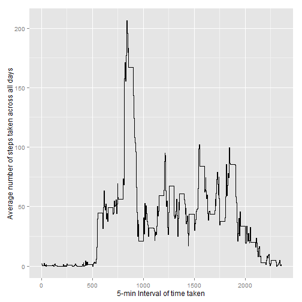
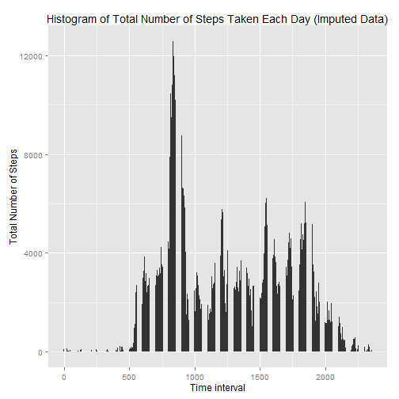
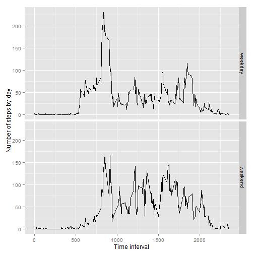

This is an R Markdown document. Processing the CSV file.


```r
activity<-read.csv("activity.csv")


summary(activity)
```

```
##      steps                date          interval     
##  Min.   :  0.00   2012-10-01:  288   Min.   :   0.0  
##  1st Qu.:  0.00   2012-10-02:  288   1st Qu.: 588.8  
##  Median :  0.00   2012-10-03:  288   Median :1177.5  
##  Mean   : 37.38   2012-10-04:  288   Mean   :1177.5  
##  3rd Qu.: 12.00   2012-10-05:  288   3rd Qu.:1766.2  
##  Max.   :806.00   2012-10-06:  288   Max.   :2355.0  
##  NA's   :2304     (Other)   :15840
```

Plotting the steps by day.


```r
library(ggplot2)
StepsbyDay<-tapply(activity$steps,activity$date,sum,na.rm=TRUE)
qplot(StepsbyDay,bandwidth=1000,xlab = "Total steps taken by day")
```

 

```r
#Mean of the steps per day
mean(StepsbyDay,na.rm = TRUE)
```

```
## [1] 9354.23
```

```r
#Median of the steps per day
median(StepsbyDay,na.rm = TRUE)
```

```
## [1] 10395
```

```r
##Finding average of daily activity plan
average<-aggregate(x=list(steps=activity$steps),by=list(interval=activity$interval),mean,na.rm=TRUE)
ggplot(data=average,aes(x=interval,y=steps))+geom_step()+xlab("5-min Interval of time taken")+ylab("Average number of steps taken across all days")
```

 

```r
#maximum of average steps
average[which.max(average$steps),]
```

```
##     interval    steps
## 104      835 206.1698
```

```r
##Imputing Missing Values
#number of missing values
sum(is.na(activity$steps))
```

```
## [1] 2304
```

```r
actwona<-activity
for(i in 1:nrow(actwona))
{
    if(is.na(actwona$steps[i]))
    {
        actwona$steps[i]<-average[which(actwona$interval[i]==average$interval),]$steps
    }
}

plot3 <- ggplot(actwona, aes(interval, steps)) + geom_bar(stat = "identity",binwidth = .5) +
        labs(title = "Histogram of Total Number of Steps Taken Each Day (Imputed Data)",x = "Time interval", y = "Total Number of Steps")
print(plot3)
```

 

```r
actbyDay<-tapply(actwona$steps,actwona$date,sum,na.rm=TRUE)
#Mean of actual data without missing value
mean(actbyDay,na.rm = TRUE)
```

```
## [1] 10766.19
```

```r
#Meadian of actual data without missing value
median(actbyDay,na.rm = TRUE)
```

```
## [1] 10766.19
```

After imputing the missing values with the average values, there seems to be some difference between the actual mean,median with the  dataset which has na values.

```r
## create new data frame
activitytype <- actwona
weekend <- weekdays(as.Date(activitytype$date)) %in% c("Saturday", "Sunday")
activitytype$daytype <- "weekday"

activitytype$daytype[weekend == TRUE] <- "weekend"
activitytype$daytype <- as.factor(activitytype$daytype)

#plotting the two different types
averagebyDay <- aggregate(steps ~ interval + daytype, data = activitytype, mean)
ggplot(averagebyDay, aes(interval, steps)) + geom_line() + facet_grid(daytype ~ .) + 
    xlab("Time interval") + ylab("Number of steps by day")
```

 
